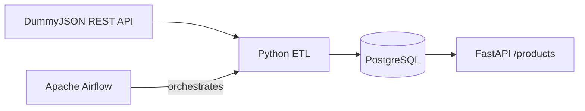

# Data Engineering Lab

[](https://github.com/RickCiaahd/studio/actions/workflows/tests.yml)

Personal hands-on project focused on modern data engineering concepts and tools. It demonstrates a small, understandable data pipeline rather than a production system.

## Overview

The project extracts product data from the public [DummyJSON](https://dummyjson.com/) REST API, selects and normalizes the fields used by the project, and loads the result into PostgreSQL. Apache Airflow provides daily orchestration, while a small FastAPI endpoint can read the loaded products.

## Architecture



## Tech Stack

- Python 3.11+
- Apache Airflow
- PostgreSQL 16
- Docker and Docker Compose
- FastAPI
- Pytest
- GitHub Actions

## Pipeline

1. **Extract** product records from the REST API with an HTTP timeout and status validation.
2. **Transform** each record into the `title`, `price`, and `category` fields used by the project.
3. **Prepare the database** by creating the `products` table when it does not exist.
4. **Load** the transformed records into PostgreSQL in one transaction.
5. **Orchestrate** the complete pipeline as a daily Airflow task.

The current load is append-only. Re-running the pipeline inserts another snapshot; deduplication and historical modelling are intentionally outside this lab's current scope.

## Project Structure

```text
.
|-- dags/
|   `-- etl_pipeline.py
|-- src/
|   |-- api/
|   |   `-- app.py
|   `-- etl/
|       |-- db.py
|       |-- extract.py
|       |-- load.py
|       |-- main.py
|       `-- transform.py
|-- tests/
|-- .env.example
|-- docker-compose.yml
|-- pytest.ini
`-- requirements.txt
```

## Running Locally

Clone the repository and enter it:

```bash
git clone https://github.com/RickCiaahd/studio.git
cd studio
```

Create your local configuration:

```bash
cp .env.example .env
```

On PowerShell, use `Copy-Item .env.example .env` instead.

Create a virtual environment and install the application dependencies:

```bash
python -m venv .venv
source .venv/bin/activate
python -m pip install --upgrade pip
pip install -r requirements.txt
```

On PowerShell, activate it with `.venv\Scripts\Activate.ps1`.

Start PostgreSQL and wait for its health check:

```bash
docker compose up -d postgres
docker compose ps
```

Run the ETL pipeline from the repository root:

```bash
python -m src.etl.main
```

The optional read API can be started after data has been loaded:

```bash
uvicorn src.api.app:app --reload
```

Then open `http://127.0.0.1:8000/products`.

### Airflow

Airflow is kept as a separate optional dependency because it is substantially larger than the ETL runtime. Install it using the official constraint file that matches your Python version:

```bash
AIRFLOW_VERSION=2.10.5
PYTHON_VERSION=3.11
pip install "apache-airflow==${AIRFLOW_VERSION}" --constraint "https://raw.githubusercontent.com/apache/airflow/constraints-${AIRFLOW_VERSION}/constraints-${PYTHON_VERSION}.txt"
```

On PowerShell, set `$env:AIRFLOW_HOME = "$PWD/airflow_home"`; on macOS/Linux, run `export AIRFLOW_HOME="$PWD/airflow_home"`. Initialize and start the local standalone service with:

```bash
airflow standalone
```

Point Airflow at this repository's DAG directory by setting `AIRFLOW__CORE__DAGS_FOLDER` to the absolute path of `dags/`, then enable or trigger the `product_etl_pipeline` DAG in the Airflow UI. The ETL's database variables must be available in the Airflow process environment.

## Testing

Install the development dependency and run the suite from the repository root:

```bash
pip install pytest
pytest
```

The tests cover extraction error handling, transformation, pipeline coordination, database configuration, loading, and the FastAPI read function without requiring live network or database services.

## CI

The GitHub Actions workflow installs the project dependencies plus pytest and runs the test suite on Python 3.11 for pushes and pull requests. It does not deploy the project.

## Learning Goals

This project was created to deepen practical understanding of:

- ETL pipeline design
- Workflow orchestration
- PostgreSQL integration
- Containerized environments
- Testing and continuous integration
- REST API integration

## Disclaimer

This is a personal learning project and not a production system.
